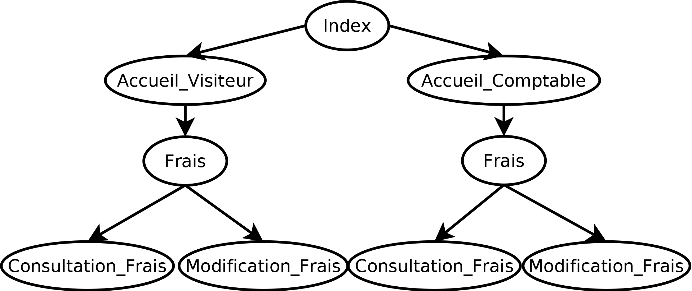
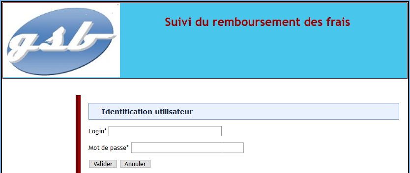
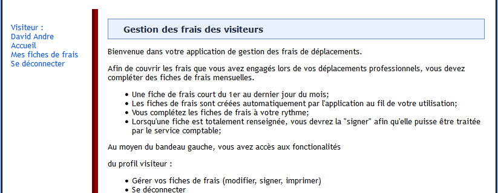
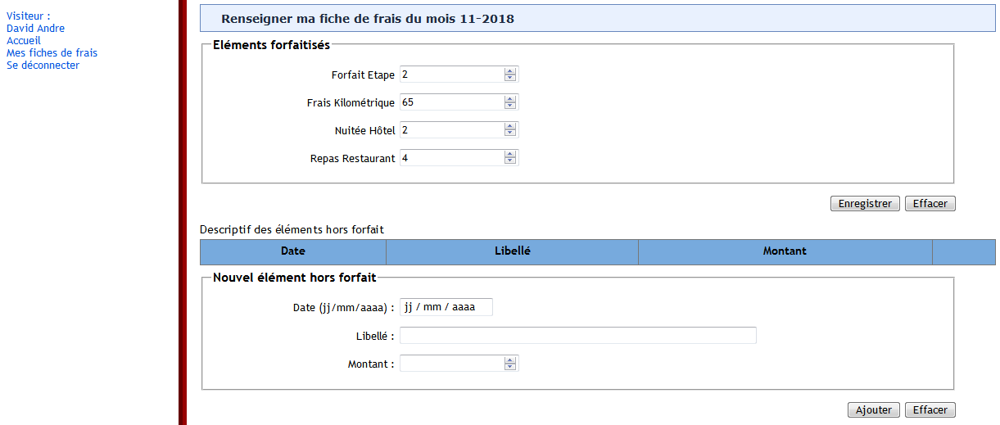

# BTSSIO2_GSBAppliFrais
Applifrais est un site web développé dans l'optique du premier Projet Personnel Encadré de BTS SIO. Ce site est pour une entreprise fictive.

## Présentation de la situation

GSB est un laboratoire pharmaceutique spécialisé dans les maladies virales. Galaxy Swiss Bourdin souhaite améliorer le suivi des visiteurs travaillant avec le laboratoire. Et plus particulièrement la gestion des frais de déplacements. Une application web permet la création des fiches de frais pour les visiteurs. Elle nécessite aussi l’accès comptable pour la validation de ces fiches.

Pour réaliser ce projet nous avions à disposition un cahier des charges avec des éléments précis à valider. Nous avions aussi des scripts pour créer la base de données et générer un jeu d'essai.

Pour la nouvel version du site les points suivants sont attendus :

* Amélioration des créations et modifications des fiches de frais visiteur, correction des bugs
* Mise à jour de la base de données pour intégrer des rôles (visiteur et comptable)
* Création de la gestion comptable des fiches de frais (modification, validation...)

## Arborescence du site

L'utilisateur en fonction de son rôle a accès à sa page d'accueil correspondante.

Le visiteur peut accéder à ses fiches via l'onglet 'Mes fiches de frais'  du bandeau gauche de la page d'accueil, de même pour le comptable. Il doit au préalable se connecter (référence à la page **index**). Le comptable aura accès aux fiches de frais des visiteurs une fois qu'ils la signent. Il pourra alors la modifier, la valider ou la refuser.

## Evolution possible

Cependant, on peut considérer d'autres améliorations que celles apportées. En effet, les comptables ne peuvent pas éditer leur propre fiche de frais, s'ils ont effectué des déplacements ou mangé dans le cadre de leur activité professionnelle. 

Il serait judicieux d'ajouter un onglet à la page d'accueil comptable pour qu'il puisse enregistrer leur frais. Prenant en considération que celui qui a rempli cette fiche de frais ne la valide pas.

## Visuels

**Page de connexion**

**Page d'accueil**

**Page de gestion des frais**

